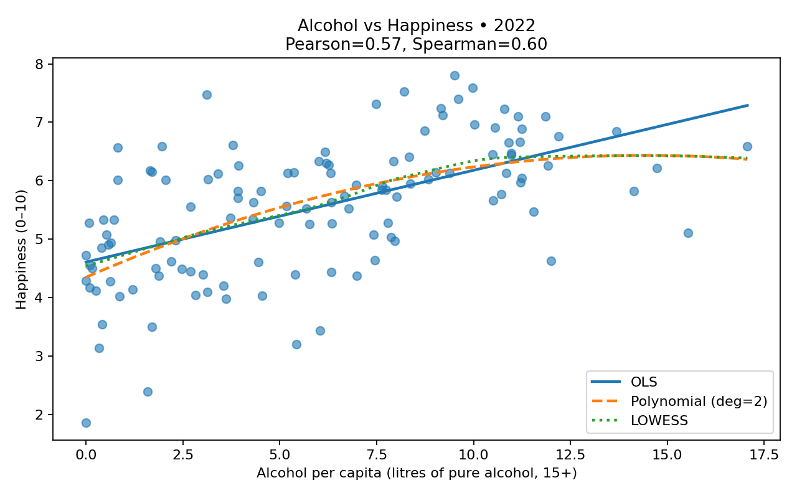
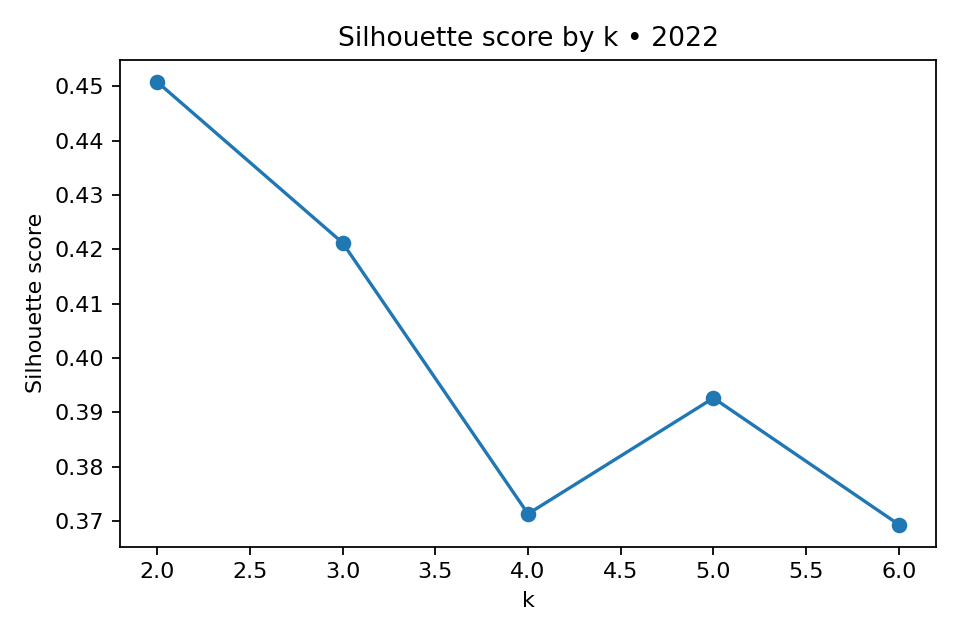
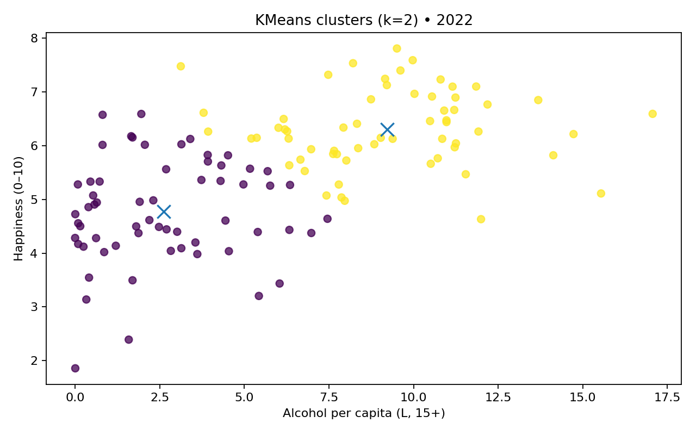
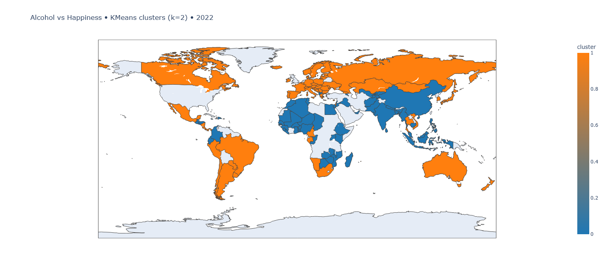

# 🍺 알코올 소비량 vs 😀 행복지수 분석/시각화

## 📂 사용 데이터

본 프로젝트는 두 개의 공공데이터를 결합하여 분석 및 시각화를 수행했습니다.

1. **알코올 소비량 데이터**

   * 파일명: `EE6F72A_ALL_LATEST.csv`
   * 출처: WHO/UN 통계 (15세 이상 1인당 연간 순수 알코올 소비량, 리터 단위)
   * 주요 컬럼:

     * `DIM_TIME`: 연도 (예: 2022)
     * `GEO_NAME_SHORT`: 국가명
     * `RATE_PER_CAPITA_N`: 15세 이상 1인당 알코올 소비량 (리터)

2. **행복지수 데이터**

   * 파일명: `WHR25_Data_Figure_2.1.xlsx`
   * 출처: World Happiness Report 2025 (Figure 2.1 시트)
   * 주요 컬럼:

     * `Year`: 연도 (2011\~2024)
     * `Country name`: 국가명
     * `Ladder score`: 행복지수 (0\~10)

---

## 🔄 데이터 가공 과정

1. **알코올 데이터 처리**

   * 컬럼명 변경
        - `DIM_TIME` → `year`
        - `GEO_NAME_SHORT` → `country`
        - `RATE_PER_CAPITA_N` → `alcohol_per_capita_litres`
   * 분석에 필요한 컬럼만 남김 (`country`, `year`, `alcohol_per_capita_litres`)
   * 음수·결측치 제거

2. **행복지수 데이터 처리**

   * 시트명: `Data for Figure 2.1 (2011–2024)` 선택
   * 컬럼명 변경
        - `Country name` → `country`
        - `Year` → `year`
        - `Ladder score` → `happiness`
   * 분석에 필요한 컬럼만 남김 (`country`, `year`, `happiness`)
   * 결측치 제거

3. **병합 및 연도 선택**

   * 두 데이터셋의 공통 연도를 추출 → 최신 연도인 **2022년** 선택
   * 동일한 국가명 기준으로 inner join 수행
   * 최종적으로 122개 국가 데이터 확보

---

## 📊 분석 및 시각화

1. **상관관계 분석**

   * Pearson 상관계수: ≈ **0.57**
   * Spearman 상관계수: ≈ **0.60**
     → 음주량과 행복지수 간에 **중간 정도의 양의 상관관계** 확인

2. **비선형 분석**

   * 단순 선형회귀(OLS), 2차 다항회귀, LOWESS(국소회귀)를 적용
   * 결과: 음주량이 적당히 높은 국가일수록 행복지수가 높은 경향
   * 하지만 15L 이상 고음주 국가는 더 이상 행복지수가 올라가지 않음 → 포화 현상 가능성

3. **클러스터링 (KMeans)**

   * 입력 변수: `alcohol_per_capita_litres`, `happiness`
   * k=2\~6 범위에서 실루엣 스코어 계산 → 최적 k=2 (score ≈ 0.45)
   * 군집 결과:

     * **Cluster 0**: 저음주·저행복 그룹 (주로 아프리카, 아시아 저개발국)
     * **Cluster 1**: 중\~고음주·고행복 그룹 (주로 유럽, 북미, 오세아니아)

4. **시각화 자료**

   * **산점도 + 회귀 곡선**: OLS, 다항, LOWESS 비교
        
   * **실루엣 스코어 그래프**: k 값 선택 근거 제공
        
   * **군집 산점도**: 클러스터별 국가 분포 확인
        
   * **세계 지도(choropleth)**: 클러스터별 국가를 색상으로 표시 (Blue vs Orange 대비 톤 적용)
        

5. **산출물**
    * `out/cluster_summary_2022.csv`: 클러스터 요약 테이블
    * `out/merged_2022.csv`: 병합된 데이터셋
---

## 📌 결론

* 국가별 **총 알코올 소비량**이 아닌 \*\*1인당 소비량(15세 이상)\*\*으로 보정해야 행복지수와 의미 있는 관계가 드러남.
* 적당한 음주가 사회적 교류나 문화적 요인과 맞물려 행복에 긍정적일 수 있지만, 과도한 음주는 행복과 더 이상 비례하지 않음.
* 클러스터링 결과는 **저음주·저행복 그룹**과 **중\~고음주·고행복 그룹**으로 크게 양분되며, 이는 국가의 경제·사회적 발전 수준과도 연관됨.
* 따라서 "술을 마시면 행복하다"라기보다는 **사회적·문화적 맥락 속에서 적당한 음주가 긍정적 영향을 가질 수 있다**는 인사이트를 제공.
